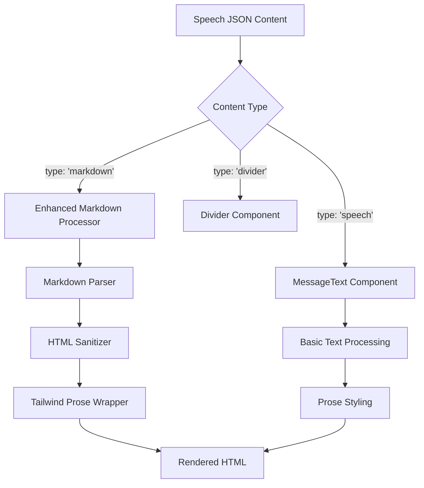

# Design Document

## Overview

This design document outlines the enhancement of markdown support in TransPal, building upon the existing basic markdown processing in `MessageText.astro`. The enhancement will provide comprehensive markdown rendering with Tailwind prose styling, ensuring consistent and beautiful formatting across all speech content types.

## Current State Analysis

### Existing Implementation
The current `MessageText.astro` component provides basic markdown-like processing:
- Bold text: `**text**` or `__text__`
- Italic text: `*text*` or `_text_`
- Inline code: `` `text` ``
- Line breaks: `\n` to `<br>`
- Basic prose styling with Tailwind

### Limitations
- Limited markdown syntax support
- No support for headers, lists, links, tables
- No code block syntax highlighting
- Manual regex-based processing (error-prone)
- No proper markdown parser

## Architecture

### Enhanced Markdown Processing Flow



### Component Architecture

```
src/components/
├── MessageText.astro (enhanced)
├── MarkdownContent.astro (new)
└── prose/
    ├── ProseWrapper.astro (new)
    └── CodeBlock.astro (new)
```

## Components and Interfaces

### 1. MarkdownContent.astro (New Component)

A dedicated component for processing full markdown content:

```typescript
interface MarkdownContentProps {
  content: string;
  className?: string;
  size?: 'sm' | 'base' | 'lg';
}
```

**Features:**
- Full markdown parsing using a proper markdown library
- Syntax highlighting for code blocks
- XSS protection with HTML sanitization
- Tailwind prose integration
- Dark mode support

### 2. Enhanced MessageText.astro

Updated to handle both simple text and markdown content:

```typescript
interface MessageTextProps {
  content: string;
  type?: 'text' | 'markdown';
  className?: string;
}
```

**Features:**
- Backward compatibility with existing simple formatting
- Automatic detection of markdown vs plain text
- Consistent prose styling
- Performance optimization for simple text

### 3. ProseWrapper.astro (New Component)

A wrapper component for consistent prose styling:

```typescript
interface ProseWrapperProps {
  size?: 'sm' | 'base' | 'lg';
  className?: string;
  children: any;
}
```

**Features:**
- Consistent Tailwind prose classes
- Dark mode support with prose-invert
- Responsive sizing
- Custom styling overrides

## Technology Stack

### Markdown Processing
- **Primary Option**: `marked` - Fast, lightweight, and well-maintained
- **Alternative**: `markdown-it` - More extensible with plugins
- **Syntax Highlighting**: `prismjs` or `highlight.js`
- **HTML Sanitization**: `dompurify` or `sanitize-html`

### Styling
- **Tailwind CSS**: Continue using existing prose classes
- **Custom CSS**: Minimal custom styles for specific elements
- **Dark Mode**: Automatic prose-invert application

## Implementation Strategy

### Phase 1: Core Markdown Processing

1. **Install Dependencies**
   ```bash
   npm install marked dompurify
   npm install -D @types/marked @types/dompurify
   ```

2. **Create MarkdownContent Component**
   - Implement markdown parsing
   - Add HTML sanitization
   - Apply Tailwind prose styling

3. **Update SpeechContent.astro**
   - Use MarkdownContent for `type: 'markdown'` items
   - Maintain existing logic for other types

### Phase 2: Enhanced Text Processing

1. **Update MessageText.astro**
   - Add markdown detection logic
   - Integrate with MarkdownContent for complex content
   - Maintain backward compatibility

2. **Implement ProseWrapper**
   - Centralize prose styling logic
   - Add responsive and dark mode support

### Phase 3: Advanced Features

1. **Syntax Highlighting**
   - Add code block highlighting
   - Support multiple programming languages
   - Optimize for build-time processing

2. **Custom Extensions**
   - Add support for custom markdown extensions
   - Implement TransPal-specific features (e.g., speaker mentions)

## Data Flow

### Markdown Content Processing

```typescript
// Input: Raw markdown string from JSON
const markdownContent = `
# Meeting Summary

This meeting covered several **important topics**:

1. Budget allocation
2. Project timeline
3. Resource planning

\`\`\`javascript
const example = "code block";
\`\`\`
`;

// Processing pipeline:
// 1. Parse markdown to HTML
const htmlContent = marked(markdownContent);

// 2. Sanitize HTML for security
const safeHtml = DOMPurify.sanitize(htmlContent);

// 3. Apply Tailwind prose styling
// 4. Render in component with dark mode support
```

### Content Type Detection

```typescript
function detectContentType(text: string): 'text' | 'markdown' {
  // Check for markdown indicators
  const markdownPatterns = [
    /^#{1,6}\s/m,           // Headers
    /^\s*[-*+]\s/m,         // Lists
    /^\s*\d+\.\s/m,         // Numbered lists
    /```[\s\S]*```/,        // Code blocks
    /\[.*\]\(.*\)/,         // Links
    /\|.*\|/m,              // Tables
  ];
  
  return markdownPatterns.some(pattern => pattern.test(text)) 
    ? 'markdown' 
    : 'text';
}
```

## Security Considerations

### XSS Prevention
- **HTML Sanitization**: All markdown-generated HTML will be sanitized
- **Allowed Tags**: Whitelist approach for permitted HTML elements
- **Attribute Filtering**: Remove potentially dangerous attributes

### Content Security Policy
```javascript
// Recommended CSP headers for markdown content
const csp = {
  'default-src': "'self'",
  'img-src': "'self' data: https:",
  'style-src': "'self' 'unsafe-inline'", // For Tailwind
  'script-src': "'self'", // No inline scripts from markdown
};
```

## Performance Optimization

### Build-Time Processing
- **Static Generation**: Process markdown during build time
- **Caching**: Cache processed HTML to avoid re-processing
- **Code Splitting**: Load syntax highlighting only when needed

### Runtime Optimization
- **Lazy Loading**: Load heavy components only when visible
- **Memoization**: Cache processed content in memory
- **Bundle Size**: Use tree-shaking to minimize library size

## Styling Guidelines

### Tailwind Prose Configuration

```css
/* Custom prose styling for TransPal */
.prose-transpal {
  @apply prose prose-gray dark:prose-invert max-w-none;
}

.prose-transpal h1,
.prose-transpal h2,
.prose-transpal h3 {
  @apply text-gray-900 dark:text-gray-100;
}

.prose-transpal code {
  @apply bg-gray-100 dark:bg-gray-800 px-1 py-0.5 rounded text-sm;
}

.prose-transpal pre {
  @apply bg-gray-50 dark:bg-gray-900 border border-gray-200 dark:border-gray-700;
}
```

### Responsive Design
- **Mobile**: Smaller prose size, adjusted line height
- **Tablet**: Standard prose sizing
- **Desktop**: Larger prose with optimal reading width

## Error Handling

### Graceful Degradation
```typescript
function renderMarkdown(content: string): string {
  try {
    const html = marked(content);
    return DOMPurify.sanitize(html);
  } catch (error) {
    console.warn('Markdown processing failed:', error);
    // Fallback to basic text processing
    return content.replace(/\n/g, '<br>');
  }
}
```

### Error Boundaries
- **Component Level**: Catch rendering errors in markdown components
- **Build Time**: Validate markdown content during static generation
- **Runtime**: Provide fallback content for processing failures

## Testing Strategy

### Unit Tests
- **Markdown Processing**: Test various markdown syntax
- **HTML Sanitization**: Verify XSS protection
- **Component Rendering**: Test component output

### Integration Tests
- **Page Rendering**: Test markdown in speech pages
- **Dark Mode**: Verify styling in both themes
- **Responsive**: Test on different screen sizes

### Performance Tests
- **Build Time**: Measure markdown processing impact
- **Bundle Size**: Monitor JavaScript bundle growth
- **Runtime**: Test rendering performance with large content

## Migration Plan

### Backward Compatibility
- **Existing Content**: Continue to work without changes
- **API Compatibility**: Maintain existing component interfaces
- **Gradual Migration**: Allow mixed content types

### Content Migration
1. **Audit Existing Content**: Identify content that would benefit from markdown
2. **Update JSON Files**: Convert appropriate content to markdown type
3. **Validate Output**: Ensure all content renders correctly
4. **Performance Testing**: Verify no regression in build times

## Monitoring and Analytics

### Performance Metrics
- **Build Time Impact**: Monitor markdown processing time
- **Bundle Size**: Track JavaScript bundle size changes
- **Page Load Speed**: Measure impact on page performance

### Content Analytics
- **Markdown Usage**: Track adoption of markdown features
- **Error Rates**: Monitor markdown processing failures
- **User Engagement**: Measure impact on reading experience

## Future Enhancements

### Advanced Features
- **Interactive Elements**: Support for interactive markdown extensions
- **Custom Shortcodes**: TransPal-specific markdown extensions
- **Real-time Preview**: Live markdown editing capabilities

### Integration Opportunities
- **Search Enhancement**: Better search indexing of markdown content
- **Export Features**: PDF/Word export with proper formatting
- **Accessibility**: Enhanced screen reader support for structured content